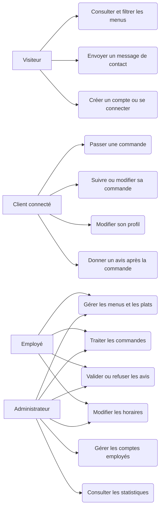
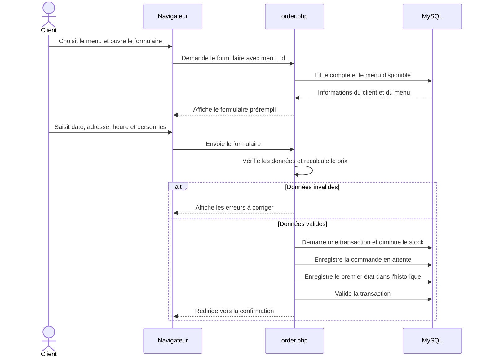

# Diagrammes de l'application

Ces diagrammes décrivent les fonctions présentes dans le projet. Ils complètent le [schéma relationnel](SCHEMA_RELATIONNEL.md), qui représente les tables MySQL.

## 1. Cas d'utilisation

Un visiteur peut consulter les menus sans compte. Pour commander, il doit créer un compte ou se connecter. L'employé gère les commandes et le contenu du site. L'administrateur peut aussi gérer les comptes employés et consulter les statistiques.

À l'oral : « J'ai séparé les actions selon le rôle. Le visiteur découvre l'offre, le client passe et suit ses commandes, l'employé traite l'activité quotidienne et l'administrateur dispose en plus des comptes employés et du tableau de bord. »

## 2. Séquence : passer une commande

Ce scénario commence une fois que le client est connecté et a choisi un menu. Le calcul du prix est refait côté PHP lors de la validation : l'affichage immédiat en JavaScript ne suffit pas à sécuriser le montant.

À l'oral : « Une transaction évite de diminuer le stock si l'enregistrement de la commande échoue. La commande commence à l'état `pending`, et ce premier état est aussi conservé dans l'historique. »

## 3. Où interviennent les deux bases ?

MySQL conserve les données nécessaires au fonctionnement du site : comptes, menus, commandes et suivi. MongoDB sert au tableau de bord : lorsque l'administrateur l'ouvre, le site copie les informations utiles des commandes dans une collection `order_stats`, sans nom, adresse, téléphone ni e-mail du client. Le graphique lit ensuite cette collection. MySQL reste la source principale des commandes.

Cette séparation est un choix de projet pour répondre à la consigne d'utiliser aussi une base non relationnelle ; pour ce petit volume de données, MySQL seul aurait suffi techniquement.
