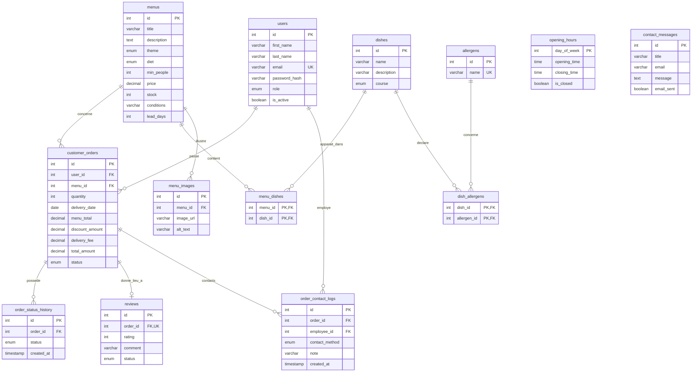

# Schéma relationnel — version actuelle

Ce schéma représente les tables créées par les fichiers SQL du projet.

## Lecture simple

- Un utilisateur peut passer plusieurs commandes ; une commande appartient à un seul utilisateur.
- Un menu peut apparaître dans plusieurs commandes ; une commande concerne un seul menu.
- Un menu comporte plusieurs plats, et un plat peut figurer dans plusieurs menus : `menu_dishes` est la table de liaison.
- Un plat peut déclarer plusieurs allergènes, et un allergène peut concerner plusieurs plats : `dish_allergens` est la seconde table de liaison.
- Un menu peut avoir plusieurs images. La première est l’image principale.
- Une commande terminée peut recevoir au plus un avis. Son statut `pending`, `approved` ou `rejected` décide de sa visibilité publique.
- `opening_hours` contient sept lignes indépendantes, une par jour de la semaine.
- Chaque modification ou annulation faite par l’équipe conserve une trace du contact client dans `order_contact_logs`.
- Une commande peut avoir plusieurs lignes d’historique ; chaque ligne correspond à un changement de statut.
- Un message de contact peut être envoyé sans compte. Il n’a donc pas de lien obligatoire avec `users`.

`PK` désigne la clé primaire, `FK` la clé étrangère et `UK` une valeur unique.

## Choix de conception

Le prix du menu, la remise et la livraison sont copiés dans la commande au moment de sa création. Si le prix d’un menu change plus tard, l’ancien montant de la commande reste compréhensible.
