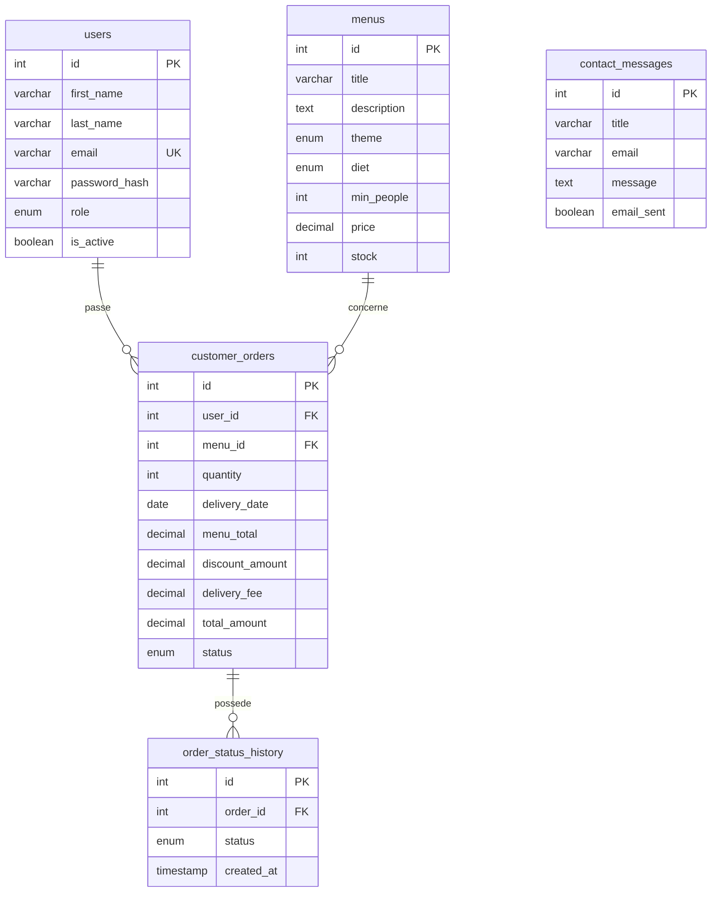

# Schéma relationnel — version actuelle

Ce schéma représente les tables réellement créées par les fichiers SQL du projet. Il sera complété quand la gestion des plats, des allergènes et des avis sera ajoutée.

## Lecture simple

- Un utilisateur peut passer plusieurs commandes ; une commande appartient à un seul utilisateur.
- Un menu peut apparaître dans plusieurs commandes ; une commande concerne un seul menu.
- Une commande peut avoir plusieurs lignes d’historique ; chaque ligne correspond à un changement de statut.
- Un message de contact peut être envoyé sans compte. Il n’a donc pas de lien obligatoire avec `users`.

`PK` désigne la clé primaire, `FK` la clé étrangère et `UK` une valeur unique.

## Choix de conception

Le prix du menu, la remise et la livraison sont copiés dans la commande au moment de sa création. Si le prix d’un menu change plus tard, l’ancien montant de la commande reste compréhensible.
